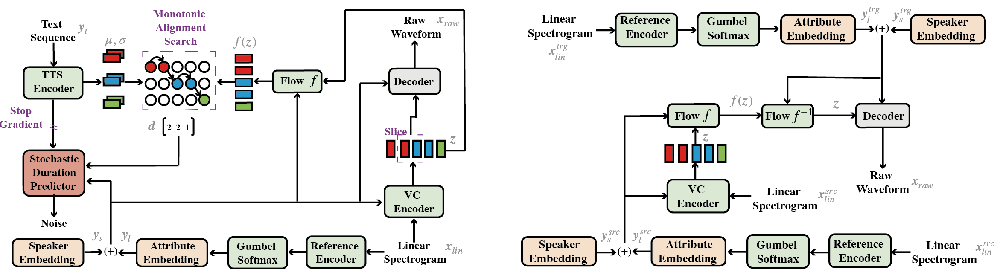

# Emotional Voice Conversion with Semi-Supervised Generative Modeling
### Hai Zhu, Huayi Zhan, Hong Cheng, Ying Wu
The task of Emotional V ocal Conversion (EVC) aims to transform the emotional state of speech from one to another while preserving linguistic information and speaker identity. However, previous research in this field has been limited to converting labeled and parallel emotional speech data, which is not widely available in real-life applications. This paper proposes a novel semi-supervised generative model called SGEVC for emotional voice conversion. Our proposed method utilizes variation autoencoder (VAE) frameworks to disentangle linguistic, speaker identity, and emotion spaces. Additionally, we integrate Text-to-Speech (TTS) into the EVC framework to guide the linguistic content and design the SGEVC framework in an end-to-end manner. This paper demonstrates that using as little as 1% supervised data (20 minutes) is sufficient to achieve emotional voice conversion. Our experimental results show that our proposed model achieves outstanding performance and consistently outperforms EVC baseline frameworks.

Visit our [demo](https://zhu1hai.github.io/sgevc/) for audio samples.

We also provide the [SGEVC-1 model](https://drive.google.com/file/d/1uzO39mKxiZiirobls1u1ogba65fA6n22/view?usp=sharing).

<table style="width:100%">
  <tr>
    <th>Diagram of the proposed approach, showing the trainng procedure (left) and inference procedure(right).</th>
  </tr>
  <tr>
    <td></td>
  </tr>
</table>
